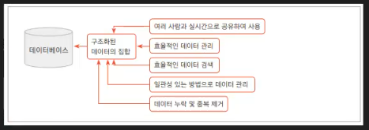

# java-database-2026
자바개발자 과정 데이터베이스 리포지토리

---
## Day 01
### 데이터 / 정보
데이터는 단순한 컴퓨터환경의 특정 값을 의미한다. 정보는 이러한 데이터에 의미를 부여한 것.

### 데이터베이스 (Database : DB)
데이터를 기반으로 하는 관리 시스템을 의미. 데이터를 모아둔 장소를 의미하기도 함.
- DataBase Management System -> DBMS 라고 부른다. 줄여서 DB라고도 함.
- 대부분 기업의 `도메인 정보`를 저장하고 있음



### 데이터 베이스 종류
- 관계형 데이터베이스 (RDBMS)
    - Oracle - 학습할 DB
    - SQLServer - Microsoft사 제품, Oracle보다 성능이 낮음
    - MySQL - 오픈소스지녕ㅇ에서 Oracle로 합병
    - MariaDB - MySQL 개발자들이 다시 만든 오픈소스 DB
    - PostgreSQL

- NoSQL 데이터베이스(빅데이터...)
    - Redis
    - MongoDB
    
- In-Memory 데이터베이스
    - SAP HANA (겁나 빠름)

### 오라클 설치 방법
 1. 로컬 설치

 2. 도커 설치(클라우드 동일)

 ### 오라클 설치 이전
 1. 도커 설치 - DevOps의 필수품
    - https://www.doker.com/
    - Download Docker Desktop 버튼 클릭
    - Download for Windows - AMD64 선택
2. Docker command 사용


    - 컨테이너 실행
    ```
    docker run -d --name oracle-xe -p 1521:1521 -e ORACLE_PASSWORD=P12345s! gvenzl/oracle-xe:21-slim
    ```

### DBeaver 사용법

- Database Navigator 에서 DB연결 시작

    

    - 마우스 오른쪽버튼 > Create > Connection

        

- 연결정보 입력 Test Connection
- 입력 시 주의사항 : port번호 확인, Database 이름변경 Oracle -> XE로, Username, Password 일치

    


### 기본 사용법

- DBeaver
    - 연결된 XE - java > Schema(Database와 같은의미) 확장 > JAVA 선택
    - 마우스 오른쪽 버튼 > SQL 편집기
    - 글자 크기 변경 > 메뉴 윈도우 > 환경 설정
        - User Interface > 모양 > 색상 및 글꼴 > DBeaver Fonts > Monospace font를 편집

    

- 샘플 데이터베이스 생성

    1. 테이블 생성 : [쿼리](./day01/1.sample_schemas.sql)
    2. 시퀀스 생성 : [쿼리](./day01/2.sequences.sql)
    3. 부서데이터 추가 : [쿼리](./day01/3.department_datas.sql)
    4. 직원데이터 추가 : [쿼리](./day01/4.employee_datas.sql)
    5. 고객데이터 추가 : [쿼리](./day01/5.customer_datas.sql)
    6. 상품데이터 추가 : [쿼리](./day01/6.product_datas.sql)
    7. 주문과 주문상세데이터 추가 : [쿼리](./day01/7.order_order_item_datas.sql)

- 간단 연습 : [쿼리]
    - DB파일은 확장자를 `.sql` 로 한다
    - 하나의 며령으로 ; 으로 끝나는 문장을 쿼리(query) 로 지칭
    - 쿼리문은 대소문자 구분 없음
    - DBeaver에서 쿼리 한줄 실행은  ctrl + ENTER
    - 여러줄 동시실행은 `Alt+x`

- SQL(Structured Query Language)
    - 구조화된 질의 언어
    - 관계형 데이터 베이스


- 오라클 함수 : DB 별로 추가학습 필요
    - 문자열 함수
        - UPPER (모두 대문자), LOWER(모두 소문자), INITCAP(첫글자만 대문자로)
        - LENGTH (문자열 길이)
        - SUBSTR (문자열, 시작, 길이)
        - INSTR (문자열, 찾을 문자열, [횟수]), 문자열에서 찾을 문자열의 위치를 리턴
        - REPLACE (문자열, 찾는 문자열, 바꿀문자열), 찾은 문자열을 바꿀 문자열로 변경
        - LPAD(문자열, 자리수, 채울문자열), RPAD(문자열, 자리수, 채울문자열), L/R 기준으로 자리수 만큼 빈 공간 특정 문자열로 채우기
        - CONCAT(앞쪽문자열, 뒤쪽문자열), 두 문자열 합치기
        - TRIM(공백있는 문자열), LTRIM,RTRIM 빈 공백 제거

    - 숫자 함수
        - ROUND (반올림할수, 반올림위치)
        - TRUNC (숫자, 버림위치)
        - CEIL (올림할수)
        - FLOOR (내림 할 수)
        - MOD (나머지구할수)

## DAY03
### 함수

- 날짜포맷 단어
    - `YYYY`, `YY` 년도 4자리 (2026), 2자리 (26)
    - `MM`,`MON`,`MONTH` - 월 두자리(03), NAR, MARCH
    - `DD`,`DDD`,`DY`,`DAY` - 일 두자리(03), 62(1월1일부터 며칠째), TUE(화), TUESDAY(화요일)
    - `HH24`, `HH`, `HH12` - 24시간, 12시간표현
    - `MI` - 분
    - `SS` - 초

- 오라클 함수 게속
    - 날짜함수
        - `sysdate` - 기본, 현재 일시를 리턴
        - `ADD_MONTHS` (날짜컬럼, 정수) - 양수(+)는 이후달, 음수(-)는 이전달
        - `MONTH_BETWEEN` (비교날짜1, 비교날짜2) - 두 날짜사이의 개월 수
        - `NEXT_DAY` (날짜, '요일') - 날짜 이후의 해달요일 날짜 리턴
        - `LAST_DAT` (날짜) - 해당 날짜의 마지막일 리턴. 예) 2월 28일 3월 31일...

    - 형변환함수
        - `TO_CHAR`(날짜, '날짜포맷') - 날짜를 해당포맷에 맞게 변경해서 표현
        - `TO_CHAR`(숫자, '숫자포맷') - 숫자를 해당포맷에 맞게 변경 표현
        - `TO_NUMBER`(숫자로만된문자데이터, '숫자포맷') - 수로된 문자열을 숫자로 변경
        - `TO_DATE`('날짜식문자데이터', '날짜포맷') - 문자데이터를 날짜데이터로 변경

    - NULL 처리함수
        - `NULL`(데이터없음)은 일부 개수처리나 통계 불가. NULL값 처리필요
        - `NVL`(넣어둘값데이터, 널처리()) - 해당 값이 NULL이면 보통 0으로 변환
        - `NVL2`(넣어둘값데이터, 널이아닐때처리, 널일때처리) - 널이 아닐때와 널일때로 나눠서 처리

    - DECODE / CASE
        - 특정열의 데이터가 어떤 데이터인지 따라 다르게 처리할 때
        - python의 if ~ elif ~ elif 와 동일한 의미
        - `DECODE` (컬럼, 조건, 결과, ...) - 오라클 전용함수
        - `CASE`문 - CASE ~ WHEN ~ THEN ~ END ...


### 다중행  /  데이터 그룹화
- 다중행 함수
    - 여러 행의 데이터를 바탕으로 하나의 결과를 도출하는 함수
    - `SUM()` - 데이터의 합. 급여, TAX, 점수 등 의미있는 데이터만 합할 것
    - `COUNT()` - 데이터 개수. NULL에 지대한 영향을 받음. 데이터형에 영향 받지 않음. *(ALL)도 가능
    - `AVG()` - 데이터의 평균. NULL에 영향을 받기때문에, NULL값은 항상 0등으로 변경해주고 계산
    - `MIN()` - 데이터 중 최소값. 날짜, 문자열도 가능
    - `MAX()` - 데이터 중 최대값. 날짜, 문자열도 가능

- 그룹화
    ```sql
    --- 나머지는 이전과 동일, 다중행함수와 GROUP BY가 추가.
    SELECT [기존과 동일], 다중행함수
      FROM [테이블명][dual]
     WHERE [조건식]
     GROUP BY [그룹화할 열 지정][ROLLUP / CUBE / GROUPING SETS]
     HAVING [그룹함수 필터링]
     ORDER BY [정렬조건]
    ```


### sample DB 생성

### 조인

